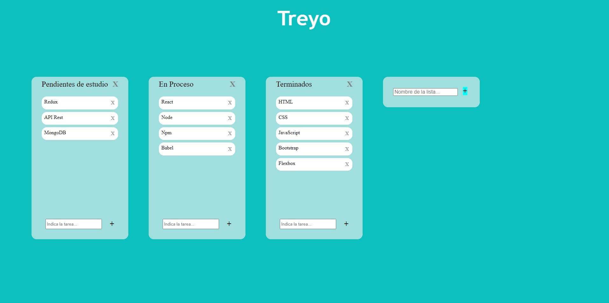

# TREYO

<p align="center">
  
</p>

Clon de Trello con funciones básicas de creación/borrado de columnas de tareas y, dentro de estas, las tareas propiamente dichas.

## 🛠️ Instalación

Clone el repositorio y despliéguelo en su servidor.

```bash
git clone https://github.com/antoniovalverde/reto3.git
```

## 💻 Uso

Añada un nombre a la nueva lista (columna) en el formulario para dicho fin y presione el botón "+" para añadir una lista.
Dentro de cada lista aparece un botón "X" en la parte superior para eliminar toda la lista.
También, en cada lista, se pueden añadir tareas en el formulario inferior, escribiendo el texto de la tarea y pulsando en el

## 🍰 Contribuciones
La ayuda es bienvenida, así como los consejos y demás. No seáis muy duros ya que se trata de mi primer proyecto en React como parte de un reto del bootcamp que estoy cursando.


## ✨ License
[MIT](https://choosealicense.com/licenses/mit/)


<p align="center">
Desarrollado con ❤️ por Antonio Valverde en España. 
</p>
